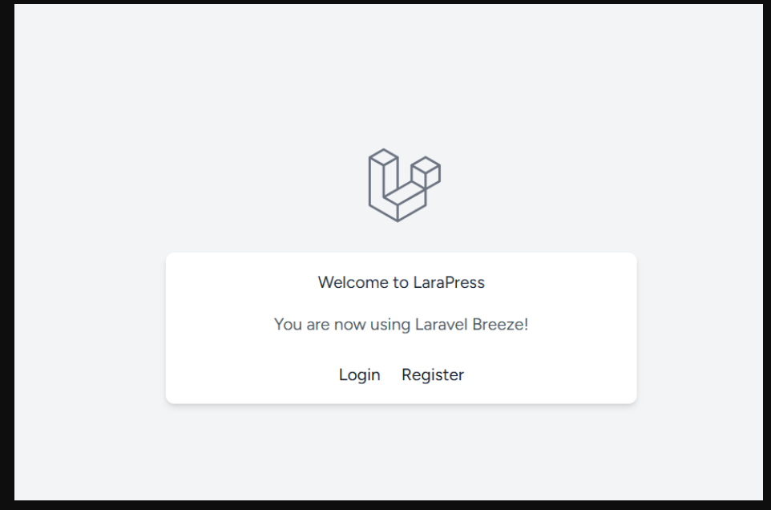
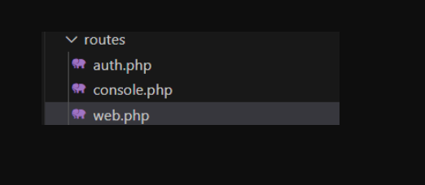
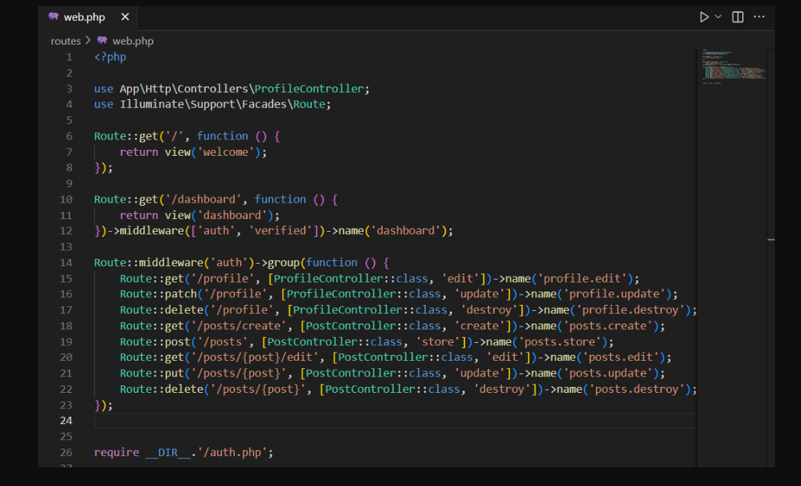
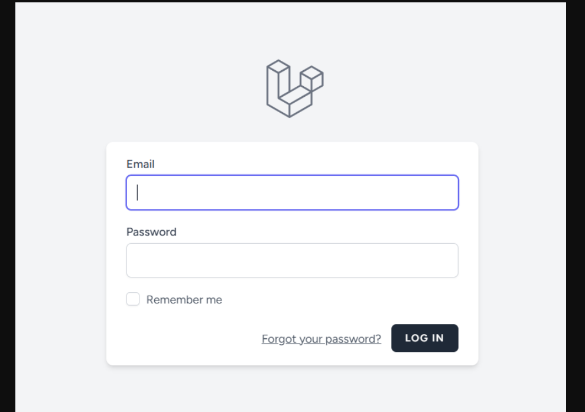

# Laporan Praktikum Pemrograman Berbasis Web
### Nama : Khlaissa Raihanah Azhari
### npm : 4523210122
---
## Langkah Pembelajaran
1. Masuk ke direktori LaraPress
   
2. Install Breeze via composer
   ```bash
   composer require laravel/breeze --dev

3. Jalankan perintah instalasi Breeze
   ```bash
   php artisan breeze:install
- Pilih (0) untuk **Blade with Alpine**
- Pilih (no)
- Pilih testing framework pilihan Anda (pilih 0 untuk Pest jika ragu). Tekan Enter.

4. Instalasi Dependensi Frontend
   ```bash
   npm install

5. Kompilasi Aset
   ```bash
   npm run dev

6. Jalankan Migrasi
   ```bash
   php artisan migrate

7. Uji coba dengan
   ```bash
   php artisan serve

---
## Membedah hasil instalasi 
1. **Lihat rute baru:**  
   Buka file `routes/web.php`, di dalamnya akan ada baris berikut:

   ```bash
   require __DIR__.'/auth.php';

2. **Lihat Controller baru:**
   Buka folder `app/Http/Controllers/Auth/`, Di sini akan menemukan
   file seperti `AuthenticatedSessionController.php` yang berisi logika untuk proses login.

3. **Lihat View baru:**
   Buka folder `resources/views/auth/`, Di sini ada file tampilan seperti `login.blade.php` dan `register.blade.php`
   File-file ini digunakan untuk menampilkan form login dan registrasi di aplikasi.

---
## Mengamankan Rute CRUD
1. Buka file `routes/web.php`
<br>


   
2. Cari semua rute yang berhubungan dengan postingan — seperti membuat, menyimpan, mengedit, memperbarui, atau menghapus postingan.

3. Bungkus semua rute itu di dalam route group yang memakai `middleware('auth')`.
   Artinya, hanya pengguna yang sudah login yang bisa mengakses rute tersebut.
- **Contoh sebelum:**
   ```bash
   Route::get('/posts/create', [PostController::class, 'create']);
   Route::post('/posts', [PostController::class, 'store']);
   // ... rute lainnya

- **Contoh sesudah:**
  ```bash
  Route::middleware('auth')->group(function () {
    Route::get('/posts/create', [PostController::class, 'create'])->name('posts.create');
    Route::post('/posts', [PostController::class, 'store'])->name('posts.store');
    Route::get('/posts/{post}/edit', [PostController::class, 'edit'])->name('posts.edit');
    Route::put('/posts/{post}', [PostController::class, 'update'])->name('posts.update');
    Route::delete('/posts/{post}', [PostController::class, 'destroy'])->name('posts.destroy');
  });

- **Contoh Program:**
  


4. Uji Coba:
   - Logout dari aplikasi
   - Coba buka URL ini di browser:
     `http://127.0.0.1:8000/posts/create`
   - hasilnya Laravel otomatis akan mengarahkan kamu ke halaman login, karena kamu belum masuk (belum login).
     

---
## Kesimpulan
Dari praktikum ini, bisa disimpulkan bahwa Laravel Breeze membantu membuat sistem autentikasi (login dan register) dengan cepat dan mudah. Setelah menginstalnya, Laravel otomatis menambahkan file rute, controller, dan tampilan yang berkaitan dengan proses login dan registrasi. Selain itu, dengan menambahkan middleware auth pada rute tertentu, kita bisa membatasi akses hanya untuk pengguna yang sudah login. Hasilnya, fitur CRUD menjadi lebih aman karena tidak bisa diakses sembarang orang tanpa autentikasi. Praktikum ini membuat kita lebih paham bagaimana Laravel mengatur keamanan dan struktur proyek secara otomatis.