# pertemuan 06 Membangun CRUD Laravel + Filament (SMP Mentari)
### Nama : Khalissa Raihanah azhari
### npm : 4523210122
---- 
membuat file baru dengan 
menambahkan sintaks pada terminal dalam laragon sebagai berikut: <br>
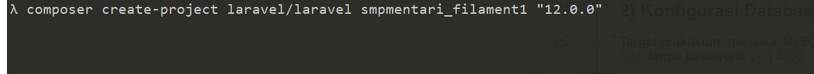
masuk ke path smpmentari_filament1 dengan <br>
``cd smpmentari_filament``<br>
nyalakan laragon menu apache ,mysql, mailpit <br>
jalankan localhost : <br>
``php artisan serve`` <br>
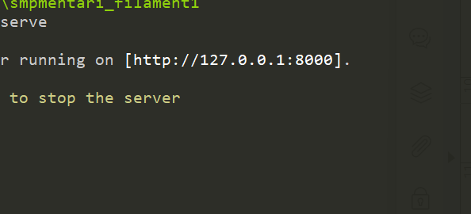
<p>
Konfigurasi Database (MySQL via Laragon)
Target praktikum: memakai MySQL bawaan Laragon Default Laragon biasanya: user
root, tanpa password.Namun, saya menggunakan password untuk root karena saya membuat database dari workbench

Buka file .env pada root proyek dan set:<br>
DB_CONNECTION=mysql<br>
DB_HOST=127.0.0.1<br>
DB_PORT=3306<br>
DB_DATABASE=smpmentari_filament1<br>
DB_USERNAME=root<br>
DB_PASSWORD=``<password saya>``
<p>

setelah konfig  di file environment bisa melakukan migrasi<br>
``php artisan migrate``

#### 3.0 Instal Filament v4 (Admin Panel)
#### 3.1 Pasang paket Filament v4 (gunakan kutip di PowerShell)
composer require "filament/filament"
#### 3.2 Generate panel admin
php artisan filament:install --panels
#What is the panel’s ID?(admin)
#### 3.3 Buat akun admin Filament
php artisan make:filament-user
ini digunakan untuk login user admin dilanjutkan ke page dashboard
 name (admin), email(testicha@sample.com), password(admin123#)

Akses panel: buka http://localhost:8000/admin, login dengan akun yang barusan
dibuat
#### 4.0 Desain Data Minimal (Tema SMP Mentari)
Kita pakai dua entitas untuk CRUD latihan: - kegiatan: judul, tanggal, ringkasan, isi,
foto - siswa: nisn, nama, jenis_kelamin, kelas, tanggal_lahir, alamat
#### 4.1 Buat Model + Migrasi<p>
``php artisan make:model Kegiatan -m `` <br>

```php artisan make:model Siswa -m``` <br>
Edit migrasi kegiatan:
// database/migrations/xxxx_xx_xx_xxxxxx_create_kegiatans_table.php 
<br>

```
public function up(): void
{
Schema::create('kegiatans', function (Blueprint $table) {
$table->id();
$table->string('judul');
$table->date('tanggal');
$table->string('ringkasan')->nullable();
$table->text('isi')->nullable();
$table->string('foto')->nullable(); // path gambar
$table->timestamps();
});
}// database/migrations/xxxx_xx_xx_xxxxxx_create_siswas_table.php
```


<br>
Jalankan migrasi:<br>
php artisan migrate5) Generate Filament Resource (CRUD otomatis)<br>
Filament akan membuat halaman List / Create / Edit lengkap.<br>

```php artisan make:filament-resource Kegiatan --generate```<br>

``php artisan make:filament-resource Siswa --generate`` <br>
Perintah di atas membuat:<br>

- app/Filament/Resources/KegiatanResource.php
- app/Filament/Resources/KegiatanResource/Pages/{Create,Edit,List}/Kegiatans.php
- app/Filament/Resources/SiswaResource.php
- app/Filament/Resources/SiswaResource/Pages/{Create,Edit,List}/
Siswas.php

membuat form kegiatan pada jalur ...\App\Filament\Resources\Kegiatans\Schemas; <br>

skema kegiatan & table kegiatan

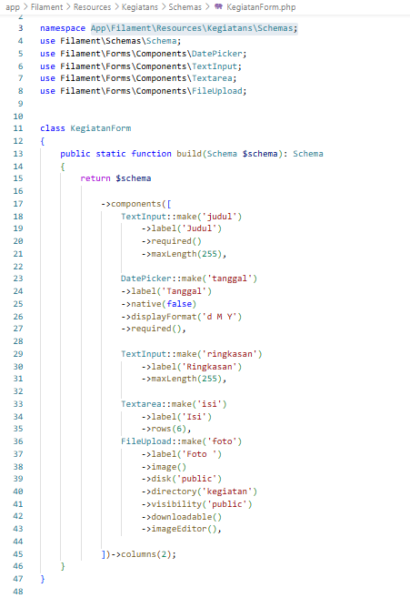


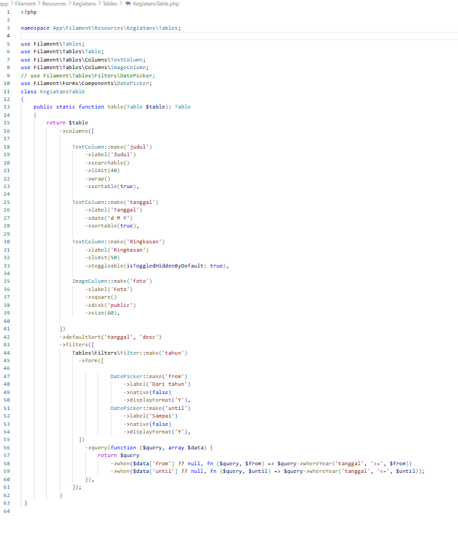
kegiatan resource

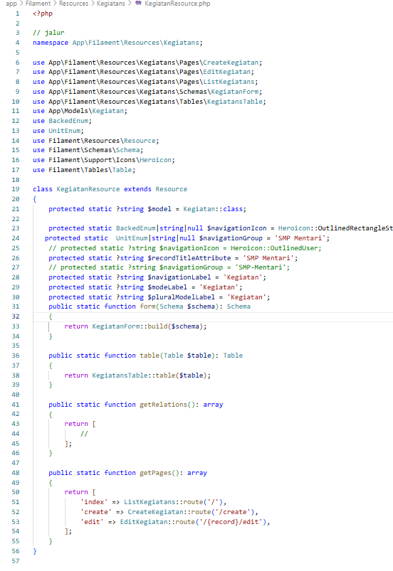


membuat form/skema/table siswa dgn php

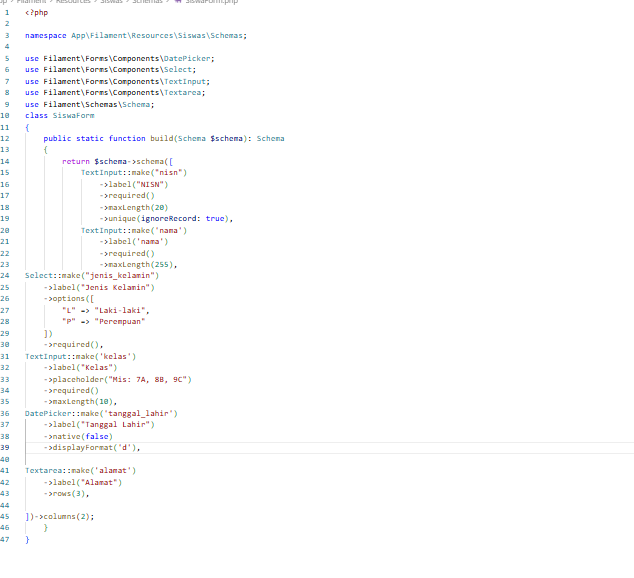
<br>
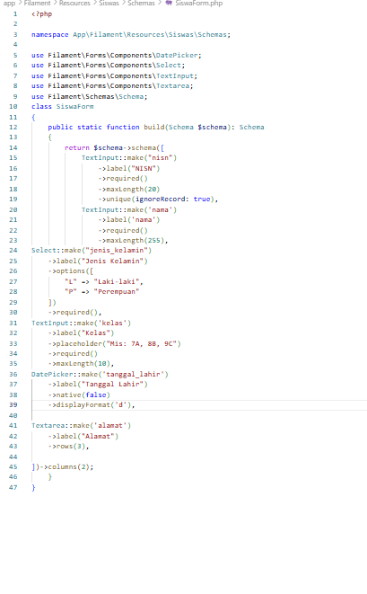


konfigurasi rute get view pada web.php

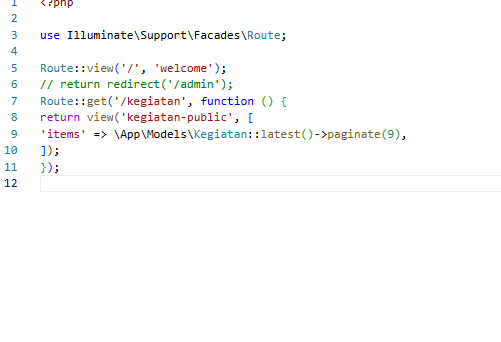

melakukan running dg menjalankan ``php artisan serve ``

tambhakan admin di belakang slash port
``http://127.0.0.1:8000/admin``

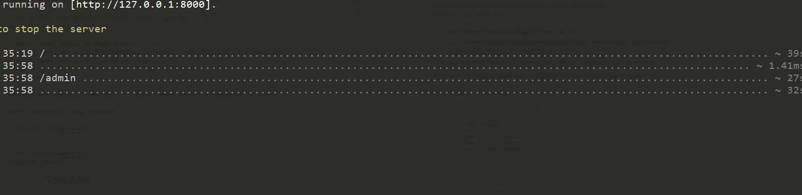

### hasil :

login --> mmenggunakan username & pwd yang telah dimasukkan pada filament-user

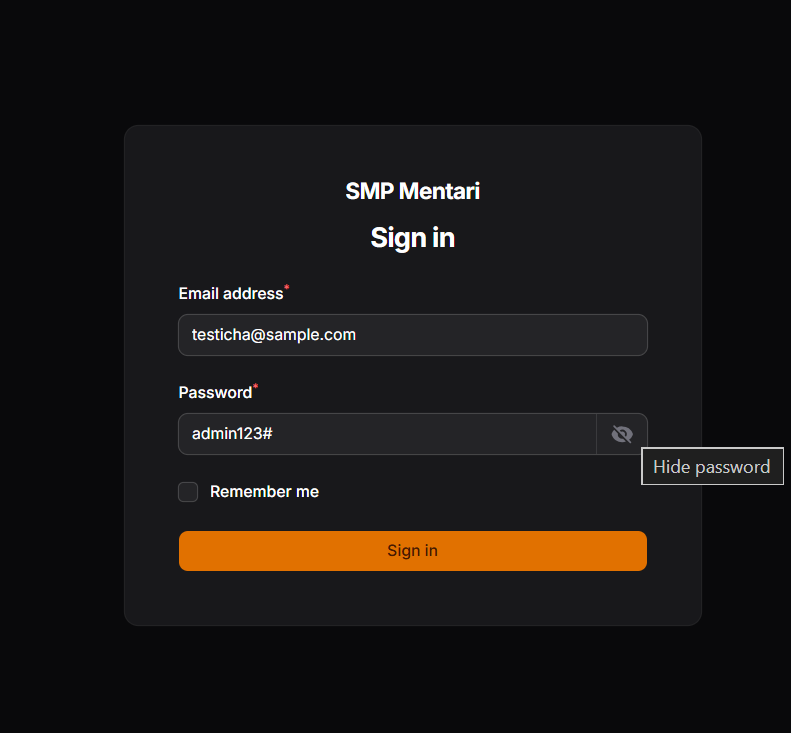

page dashboard

.png>)

page  form untuk siswa 

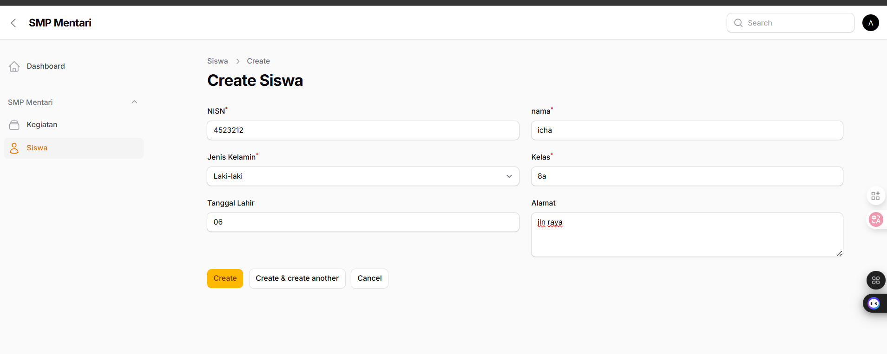

hasil record

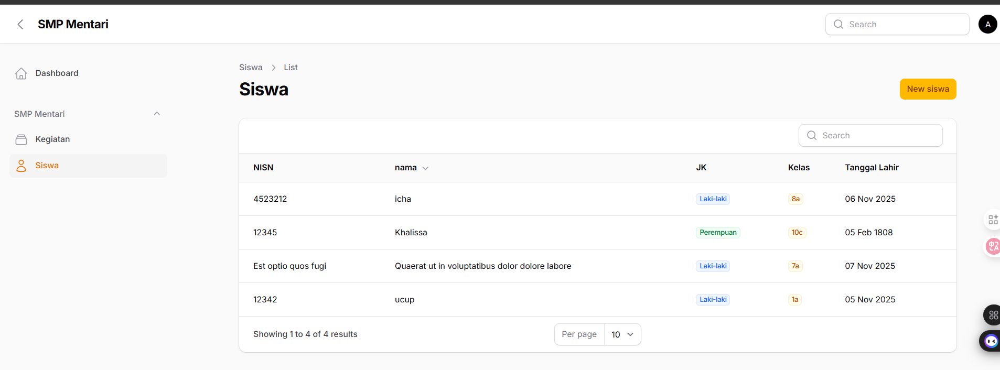

form kegiatan dan hasil record form


.png>) 

.png>)
